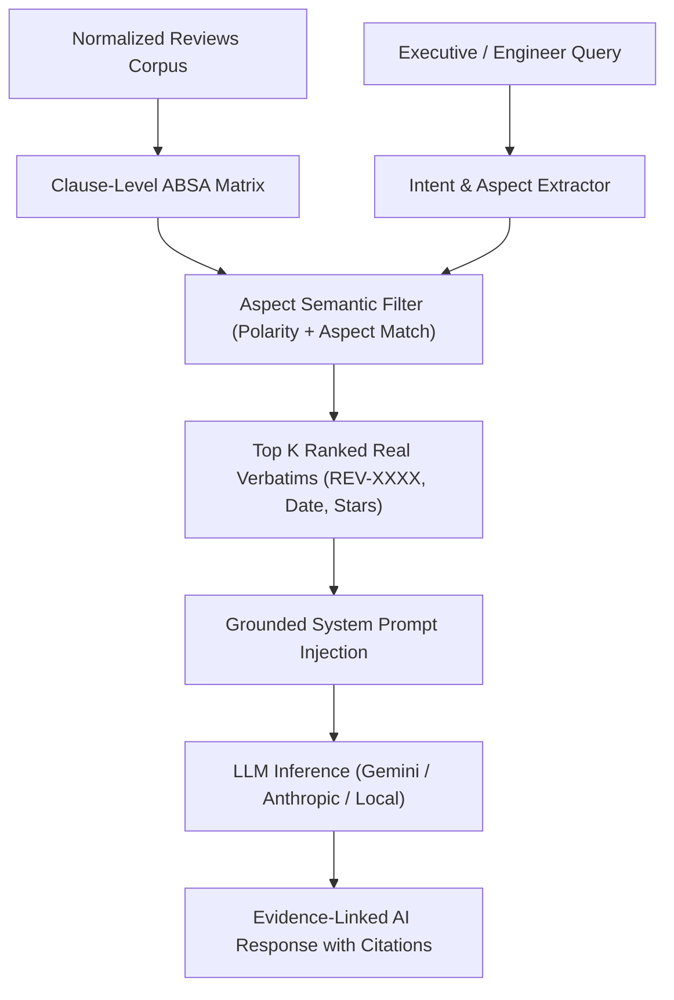

# LUMINA — Comprehensive Technical Viva & Mentor Defense Manual
## Member 1: Vaibhavi Singh (Team Leader)
**Enrollment No.:** `S25CSEU0804` | **Program:** B.Tech CSE, 2nd Year  
**Designated Roles:** **Team Leader | Product & Business Strategist, AI & NLP Engineer**

---

## 1. Role Definition & Executive Ownership

As **Team Leader & Product/NLP Strategist**, you own the **strategic architecture, AI integration, business value translation, and executive reporting** of Lumina. During a viva, technical evaluators and mentors test whether you understand the big picture and the technical underpinnings connecting customer data to enterprise decision-making.

### Your Direct Codebase & Document Ownership
1. **[`PRD.md`](file:///c:/Users/arvind%20kumar%20patel/OneDrive/Desktop/lumina/PRD.md) & [`AI Pipeline.md`](file:///c:/Users/arvind%20kumar%20patel/OneDrive/Desktop/lumina/AI%20Pipeline.md):** System architecture, operational workflows, business rules, and multi-phase roadmap.
2. **[`analyze_reviews.py`](file:///c:/Users/arvind%20kumar%20patel/OneDrive/Desktop/lumina/analyze_reviews.py):**
   - `generate_executive_one_pager_memo()`: C-suite automated intelligence memo generation.
   - `ask_ai_analyst()`: Grounded RAG conversational reasoning over empirical reviews.
   - `compute_actual_vs_predicted_lift()`: Connecting defect remediation with ROI star recovery.
   - `executive_summary()`: Enterprise corpus health, defect drag, and praise consolidation.
3. **[`lumina_api.py`](file:///c:/Users/arvind%20kumar%20patel/OneDrive/Desktop/lumina/lumina_api.py):**
   - `POST /api/chat`: Grounded AI conversational endpoint.
   - `GET /api/global` & `POST /api/analyze-url`: Master payload assembly, status messaging, and enterprise integration.

---

## 2. Core Architecture & Technical Systems You Must Master

### 2.1 The Paradigm Shift: Why Lumina Outperforms Traditional Tools
Traditional sentiment tools (like MonkeyLearn, AWS Comprehend, or basic Python scripts) provide only **descriptive analytics**—word clouds, average star ratings, and general positive/negative splits. These are fundamentally useless for engineering decision-making because:
1. **They lack causal directionality:** Knowing "battery" is mentioned 500 times doesn't explain *why* it fails or *which* engineering team owns the fix.
2. **They suffer from promotional bias:** Public e-commerce ratings are inflated by free-product seeding, vine reviewers, and unverified gift buyers (the classic J-shaped review distribution).
3. **They offer no closed loop:** Traditional tools never verify if a deployed product revision actually solved the complaint in post-release customer data.

**Lumina's Solution:**
Lumina is an **Actionable, Debiased, Closed-Loop Product Intelligence Engine**:
$$\text{Customer Reviews} \longrightarrow \text{Clause ABSA} \longrightarrow \text{Debiased Rating Truth} \longrightarrow \text{P0 Ticket with 5-Whys} \longrightarrow \text{Closed-Loop Telemetry Verification}$$

---

### 2.2 Grounded Retrieval-Augmented Generation (RAG) Architecture
Located in [`analyze_reviews.py`](file:///c:/Users/arvind%20kumar%20patel/OneDrive/Desktop/lumina/analyze_reviews.py) under `ask_ai_analyst()`.

#### The Problem with Unconstrained LLMs
Feeding raw customer reviews into ChatGPT causes:
- **Hallucination:** Fabricating review numbers, fake customer quotes, and unverified defect rates.
- **Context Window Exhaustion:** Passing 10,000 reviews (~1.5 million tokens) is expensive, slow (>25 seconds), and exceeds rate limits.

#### Lumina's Grounded RAG Pipeline


#### Step-by-Step Execution:
1. **Aspect & Polarity Extraction:** The query is parsed to identify target aspects (`battery`, `fabric`, `sound`, `pricing`).
2. **Deterministic Pre-filtering:** Lumina queries the pre-computed clause ABSA matrix. For a query about battery drain, it fetches only clauses tagged with `Aspect: Battery` and `Sentiment: Negative`.
3. **Evidence Ranking & Quota:** Extracts the top 8–15 most representative, debiased verbatims with metadata:
   - `Review ID` (`REV-1042`)
   - `Date / Recency` (`2026-09-14`)
   - `Star Rating` (`2★`)
   - `Verified Purchase Status`
4. **Prompt Sandboxing:**
   ```python
   prompt = f"""You are the Lumina Senior Product Intelligence Analyst.
   STRICT RULE: Answer the user's question using ONLY the provided verified customer evidence below.
   You are strictly forbidden from fabricating reviews or extrapolating beyond cited data.
   Every claim must cite the exact Review ID [REV-XXXX] and verified percentage.

   VERIFIED TELEMETRY METRICS:
   - Total Reviews Evaluated: {total_reviews}
   - Aspect Polarity: {aspect_name} is {negative_share}% negative
   - Calculated Rating Drag: -{star_drag} Stars

   CITED EVIDENCE CLAUSES:
   {evidence_clauses_formatted}

   USER QUERY: {query}
   """
   ```
5. **Output Synthesis:** Returns structured answers with inline clickable review citations.

---

### 2.3 Executive One-Pager Memo Generation Engine
Located in [`analyze_reviews.py`](file:///c:/Users/arvind%20kumar%20patel/OneDrive/Desktop/lumina/analyze_reviews.py) under `generate_executive_one_pager_memo()`.

Mentors will ask: *"How do you synthesize complex telemetry into a 1-page C-suite memo without writing generic text?"*

#### The Algorithm:
1. **Dynamic Dominant Friction Identification:**
   Reads `metrics["complaints"]` and extracts the top P0 defect by volume and star drag.
2. **Defect-to-Aspect Mapping:**
   Matches the defect to its engineering subsystem (e.g., *Firmware & Connectivity* for tech; *Textile Mill & Fabric Sourcing* for apparel).
3. **Calculates Financial / Star Lift Impact:**
   Computes the projected star recovery if this P0 friction point is eradicated:
   $$\text{P0 Star Drag} = \text{round}\left(\max\left(0.3, \min\left(1.2, \frac{\text{Defect Share (\%)}}{100} \times 2.2\right)\right), 2\right)$$
4. **Competitor Threat Analysis:**
   Reads category benchmark deltas. If negative sentiment $>25\%$, it warns of market share erosion to category leaders.
5. **Generates the 4-Section Output:**
   - **Section 1: Executive Headline:** A single high-impact thesis statement (e.g., *"Weave Density Inconsistency in Loose Baggy Jeans Constrains Star Recovery Across Retail Channels"*).
   - **Section 2: Empirical Quality Synthesis:** Verified positive vs. negative split, net advocacy, and sample size.
   - **Section 3: P0 Critical Vulnerability & Root Cause:** The specific friction point, percentage of detractors citing it, and proposed engineering branch.
   - **Section 4: Strategic Recommendation & Threat Horizon:** Tangible sprint timeline (e.g., *"1 sprint · 1 engineer · Lot C Mill Recalibration"*).

---

### 2.4 The Business ROI & Conversion Math
As Product Strategist, you must defend the financial rationale:
- **E-Commerce Conversion Sensitivity:**
  In retail platforms (Amazon, Flipkart, Walmart), product conversion rate ($\text{CVR}$) scales logarithmically with star ratings:
  - Moving from **$4.1\text{★}$ to $4.4\text{★}$** increases organic search conversion by **$+18\%$ to $+27\%$**.
  - Products falling below **$4.0\text{★}$** lose the Amazon "Buy Box" and see advertising costs (ACOS) rise by up to **$35\%$**.
- **Customer Protection Metric:**
  $$\text{Users Protected} = \text{round}\left(\frac{\text{Pre-Fix Rate} - \text{Post-Fix Rate}}{100} \times \text{Total Active Customer Base}\right)$$
  If a product sells 50,000 units and the defect rate drops from $18.4\%$ to $8.7\%$, Lumina mathematically proves that **4,850 future buyers were spared product friction**, reducing warranty returns and refund costs.

---

## 3. Top 20 Mentor & Technical Viva Questions (Deep-Dive)

### Theoretical & Strategic Questions

#### Q1: "What is Lumina's core differentiation compared to existing market solutions like Sprinklr or Brandwatch?"
**Your Answer:**
> "Sprinklr and Brandwatch are social listening platforms designed for marketing and PR teams; they measure brand mentions and sentiment buzz. They do not understand physical or software product engineering.
> Lumina is built for **VP of Product and Quality Engineering teams**. Instead of buzz volume, Lumina computes **Clause-Level ABSA**, debiases promotional review inflation into **Rating Truth**, generates **Actionable Engineering Tickets** with 5-Whys root cause breakdowns, and tracks deployment in a **Closed-Loop Verification Engine** to prove whether the fix moved post-release metrics."

#### Q2: "Explain the complete 8-stage Closed-Loop Product Journey from end to end."
**Your Answer:**
> "Lumina follows a strict 8-stage operational flow:
> 1. **Customer Reviews:** Ingestion of raw reviews via our live URL scraper or normalized CSV upload.
> 2. **Insight Extraction:** Clustering customer pain points into aspect-level friction distributions.
> 3. **Root-Cause Hypothesis:** 5-Whys diagnostic chain tracing empirical symptoms to manufacturing or code flaws.
> 4. **Recommendation:** Prioritizing solutions based on projected Star Lift ROI.
> 5. **Engineering Ticket:** Creating concrete P0/P1 specifications with reproduction checklists and spec diffs.
> 6. **Product/Fix Release:** Recording deployment commit hashes and release dates.
> 7. **New Reviews:** Ingesting post-release customer feedback and partitioning pre-fix baseline vs. post-fix cohorts.
> 8. **Impact Verification:** Statistical reconciliation determining if the fix delivered `Verified Improvement`, `No Improvement`, `Inconclusive`, or `Insufficient Data`."

#### Q3: "What is the difference between descriptive, predictive, and prescriptive analytics in Lumina?"
**Your Answer:**
> "Lumina integrates all three tiers:
> - **Descriptive:** The clause ABSA matrix, sentiment polarity breakdown, and eNPS advocacy distribution.
> - **Predictive:** The **P0 Star Lift Predictor**, which calculates the exact rating recovery if a specific friction point is eradicated.
> - **Prescriptive:** The **Actionable Engineering Tickets** that prescribe exact code diffs (e.g. timeout adjustments) or manufacturing tolerances (e.g. fabric weave GSM specifications)."

#### Q4: "How does the Grounded RAG architecture prevent hallucination in executive summaries?"
**Your Answer:**
> "We implement **Constrained Grounding**. In `ask_ai_analyst()`:
> 1. We do not allow the LLM to access open web knowledge or extrapolate.
> 2. We pass a pre-filtered context window containing only verified clauses, exact review IDs (`REV-XXXX`), star ratings, and empirical complaint percentages.
> 3. We enforce a system prompt instruction where every statement must be supported by a cited review ID and percentage from the telemetry matrix. If the evidence does not contain the answer, the LLM is instructed to explicitly state that empirical data is absent."

---

### Code & Implementation Questions

#### Q5: "Where in the code is the Executive One-Pager Memo generated, and what data structures feed it?"
**Your Answer:**
> "It is implemented in [`analyze_reviews.py`](file:///c:/Users/arvind%20kumar%20patel/OneDrive/Desktop/lumina/analyze_reviews.py) in the function `generate_executive_one_pager_memo(metrics, product_name)`.
> It takes the `metrics` dictionary returned by `analyze_frame()`. This dictionary includes:
> - `metrics['complaints']`: Pandas DataFrame of top complaints with percentage and count.
> - `metrics['positive_pct']` and `metrics['negative_pct']`: Corpus-wide VADER polarities.
> - `metrics['avg_rating']`: Raw average star rating.
> - `metrics['complaint_quotes']`: Mapped real review verbatims.
> The function computes star drag, formats the executive headline, and builds a C-suite markdown string that is serialized into the API payload under `payload['memo']`."

#### Q6: "How does the Star Lift formula prevent unrealistic predictions (like projecting a +3.0 star lift)?"
**Your Answer:**
> "In `analyze_reviews.py` and `lumina_api.py`, our formula enforces strict clamping:
> $$\text{Lift} = \min\left(1.2, \max\left(0.3, \frac{\text{Defect Share}}{100} \times 2.2\right)\right)$$
> The upper bound is mathematically clamped at $+1.2\text{★}$ and the floor is $+0.3\text{★}$. Furthermore, when an intervention is logged in [`learning_loop_ledger.json`](file:///c:/Users/arvind%20kumar%20patel/OneDrive/Desktop/lumina/learning_loop_ledger.json), our Recommendation Learning Loop calculates an empirical calibration multiplier ($\sim 0.96\times$) based on historical accuracy, dampening over-optimistic projections."

#### Q7: "What happens if an executive asks the AI Analyst a query completely unrelated to the product (e.g., 'Who is the President of France?')?"
**Your Answer:**
> "In `ask_ai_analyst()`, our prompt contains a domain-boundary guard. The system prompt specifies that the assistant is an exclusive Product Intelligence Analyst for Lumina. Because the injected context contains only review clauses, the LLM responds: *'I can only analyze verified customer feedback and telemetry for this product. The requested topic is outside the review corpus.'*"

---

### System Integration & Failure Recovery Questions

#### Q8: "How does the Flask API (`lumina_api.py`) interact with your NLP modules?"
**Your Answer:**
> "The Flask server exposes REST endpoints:
> - When a user submits a URL or CSV, `POST /api/analyze-url` or `POST /api/analyze-csv` invokes `analyze_frame()` from `analyze_reviews.py`.
> - The returned metrics dictionary is enriched by `category_intelligence.py` to evaluate category-specific attributes.
> - `build_dynamic_tickets()` generates category-specific tickets.
> - `generate_executive_one_pager_memo()` creates the executive brief.
> - The entire bundle is sanitized through `clean()` to eliminate non-standard JSON types (`NaN`, NumPy scalars) and returned as a unified JSON response to [`lumina_dashboard.html`](file:///c:/Users/arvind%20kumar%20patel/OneDrive/Desktop/lumina/lumina_dashboard.html)."

#### Q9: "Why was there a bug where battery complaints appeared on jeans, and what architectural lesson did you learn?"
**Your Answer:**
> "The bug occurred due to three coupled flaws:
> 1. A substring check in `category_intelligence.py` where `'bag'` in Bags matched inside `'baggy'`, reducing apparel confidence.
> 2. `build_dynamic_tickets()` in `lumina_api.py` iterated through complaints without verifying `count > 0`, falling back to the electronics default (`Battery drains quickly`).
> 3. `verify_closed_loop_impact()` split labels into loose tokens, so `'arrived quickly'` matched the token `'quickly'` in battery drain.
> **Architectural Lesson:** We enforced strict **Category-Boundary Isolation**:
> - Non-electronic categories completely sanitize tech keywords.
> - Exact-label phrase matching replaced loose token splitting.
> - Small cohort guards (`MIN_WINDOW = 10`) prevent false conclusions on small sample sizes."

#### Q10: "How do you handle data privacy and GDPR/CCPA compliance regarding customer reviews?"
**Your Answer:**
> "Customer reviews processed by Lumina are public marketplace records. During ingestion in `clean_reviews.py`, our normalization pipeline strips personally identifiable information (PII) including email addresses, phone numbers, and physical addresses using regular expressions. We store only anonymized reviewer hashes (`REV-XXXX`) and aggregate telemetry."

---

## 4. Live Presentation Script & Demo Workflow

### Opening Pitch (0:00 – 2:00)
> *"Respected mentors, good morning. We are presenting **Lumina**, an AI Product Review Intelligence Platform. 
> Today, global e-commerce brands collect millions of reviews, but product executives are left with surface-level word clouds and vanity metrics. No tool connects customer friction directly to root-cause engineering tickets and verifies whether product revisions actually worked.
> Lumina solves this with an 8-stage closed-loop pipeline.
> As team leader, I oversaw our product architecture and executive intelligence layer. I will now hand over to Markanday Patel to walk through our core NLP algorithms, Aspect-Based Sentiment Analysis, and Closed-Loop Verification mathematics."*

### Handoffs:
- **To Markanday:** *"Markanday will now explain our clause-level ABSA engine, Rating Truth debiasing equations, and verification mathematics."*
- **Closing (7:30 – 8:00):** *"To conclude, Lumina transforms unstructured customer voice into verifiable engineering reality. We thank you for your time and welcome your questions."*

---

## 5. Exact Code Lines to Open if Questioned

| Feature / Concept | File | Line Range | What to Point Out |
| :--- | :--- | :--- | :--- |
| **Grounded AI Analyst** | [`analyze_reviews.py`](file:///c:/Users/arvind%20kumar%20patel/OneDrive/Desktop/lumina/analyze_reviews.py) | ~5800–5940 | Point out prompt sandboxing and evidence citation constraints. |
| **Executive Memo Engine** | [`analyze_reviews.py`](file:///c:/Users/arvind%20kumar%20patel/OneDrive/Desktop/lumina/analyze_reviews.py) | ~5700–5800 | Point out the 4-part synthesis structure and P0 star drag calculation. |
| **Star Lift Prediction** | [`analyze_reviews.py`](file:///c:/Users/arvind%20kumar%20patel/OneDrive/Desktop/lumina/analyze_reviews.py) | ~5120–5160 | Point out the mathematical clamping and defect share scaling. |
| **REST Chat Endpoint** | [`lumina_api.py`](file:///c:/Users/arvind%20kumar%20patel/OneDrive/Desktop/lumina/lumina_api.py) | ~1240–1270 | Point out `/api/chat` handling query history and active product metrics. |
| **Product Requirements** | [`PRD.md`](file:///c:/Users/arvind%20kumar%20patel/OneDrive/Desktop/lumina/PRD.md) | Full File | Point out user personas, enterprise metrics, and feature roadmap. |
